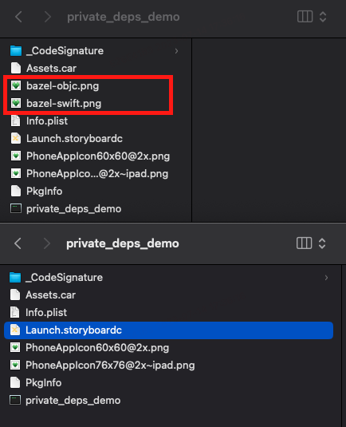

# private_deps demo

When we use `deps` in `swift_library`.

```
swift_library(
    name = "Sources",
    srcs = [
        "AppDelegate.swift",
    ],
    module_name = "Sources",
    #private_deps = [
    #    "//srcs/A:a_lib",
    #    "//srcs/B:b_lib",
    #]
    deps = [
        "//srcs/A:a_lib",
        "//srcs/B:b_lib",
    ]
)
```

Run this command in terminal to build an ipa.

`bazel build //:private_deps_demo`

Unarchive `bazel-bin/private_deps_demo.ipa`, we will see `bazel-swift.png` & `bazel-objc.png` in Payload.

But when we use `private_deps` in `swift_library`.

```
swift_library(
    name = "Sources",
    srcs = [
        "AppDelegate.swift",
    ],
    module_name = "Sources",
    private_deps = [
        "//srcs/A:a_lib",
        "//srcs/B:b_lib",
    ]
    #deps = [
    #    "//srcs/A:a_lib",
    #    "//srcs/B:b_lib",
    #]
)
```

We run the same command in terminal to build another ipa.

`bazel build //:private_deps_demo`

Let's unarchive `bazel-bin/private_deps_demo.ipa` again.

This time, there is no `bazel-swift.png` & `bazel-objc.png` in Payload.



I don't think this is an expected output. This behavior may cause some unexpected resource lost, and it's hard to discover this issue.